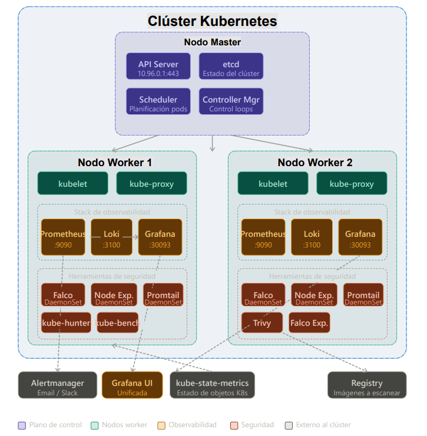

# Análisis de Vulnerabilidades y Auditoría de Seguridad en Kubernetes

## 🎯 Descripción del proyecto
Este proyecto académico, desarrollado en la Facultad de Ingeniería de la Universidad Nacional Autónoma de México, documenta la auditoría de seguridad, el análisis de vulnerabilidades, el pentesting y la detección de amenazas en runtime sobre un clúster de Kubernetes.

El objetivo principal es identificar configuraciones inseguras, vulnerabilidades en imágenes de contenedores, debilidades explotables dentro del clúster y comportamientos sospechosos en ejecución, proponiendo medidas de remediación y fortalecimiento de la postura de seguridad.

Adicionalmente, se implementa un esquema de observabilidad con herramientas especializadas para monitoreo, recolección de logs y visualización.

---

## 🏗️ Arquitectura del proyecto



---

## 🏫 Información académica
**Universidad Nacional Autónoma de México**  
**Facultad de Ingeniería**  
**Diplomado Infraestructura en Tecnologías de la Información**  

**Profesor:** Daniel Guerrero Ramirez

---

## 👥 Integrantes del equipo
- Gaytan Herrera Belen
- Pajarito Vargas Antonio
- Avila Laguna Ricardo

---

## 🧰 Herramientas utilizadas

### Auditoría y análisis de seguridad
- kube-bench
- Trivy
- kube-hunter
- Falco

### Observabilidad
- Prometheus
- Loki
- Grafana

---

## 📌 Resumen ejecutivo
En este documento se presentan los resultados de las pruebas de auditoría de seguridad y los análisis de vulnerabilidades aplicados sobre un clúster de Kubernetes.

Se evaluó la configuración del clúster con base en el CIS Kubernetes Benchmark, se escanearon imágenes de contenedores para detectar vulnerabilidades conocidas, se realizaron pruebas de pentesting en escenarios internos y externos, y se desplegó Falco para la detección de amenazas en tiempo real.

Como complemento, se implementó una arquitectura de observabilidad con Prometheus, Loki y Grafana para fortalecer la visibilidad operativa y la detección de eventos relevantes.

---

## 🔎 Definición de herramientas

### kube-bench
Herramienta de diagnóstico que verifica si Kubernetes está desplegado de forma segura mediante la ejecución de los controles definidos en el CIS Kubernetes Benchmark.

### Trivy
Escáner de seguridad para contenedores y otros artefactos que detecta vulnerabilidades de software, errores de configuración y riesgos en archivos IaC.

### kube-hunter
Herramienta de pentesting orientada a descubrir debilidades explotables en clústeres de Kubernetes, como servicios expuestos, puertos abiertos y configuraciones inseguras.

### Falco
Sistema de detección de amenazas en tiempo real para entornos Kubernetes y cloud native, basado en reglas para monitorear actividad sospechosa a nivel de sistema.

---

## 📊 Auditoría de configuración del clúster (CIS Benchmark)

### Tabla de resultados con kube-bench

| Categoría | PASS | FAIL | WARN |
|---|---:|---:|---:|
| 1. Master Node Security Configuration | 38 | 9 | 12 |
| 2. Etcd Node Configuration | 7 | 0 | 0 |
| 3. Control Plane Configuration | 0 | 0 | 5 |
| 4. Worker Node Security Configuration | 16 | 2 | 6 |
| 5. Kubernetes Policies | 6 | 0 | 29 |

---

## 🚨 Hallazgos críticos principales
Entre los hallazgos más relevantes se identificaron:

- Configuración insegura de parámetros del API Server  
- Falta de configuración adecuada de auditoría  
- Parámetros de profiling habilitados  
- Permisos débiles en archivos críticos del kubelet  
- Riesgos en la configuración del plano de control y nodos worker  

---

## 🐳 Análisis de vulnerabilidades en imágenes
Se escanearon tres imágenes dentro del clúster:

- nginx  
- postgres:15  
- redis:7.0.10  

### Propuestas de mejora

| Imagen actual | Propuesta de mejora |
|---|---|
| nginx | nginx:alpine |
| postgres:15 | postgres:15-alpine |
| redis:7.0.10 | redis:7.0-alpine |

---

## 🛡️ Pentesting del clúster
Se realizaron pruebas en dos escenarios:

- Escaneo interno  
- Escaneo externo  

A partir de los resultados, se identificó una posible cadena de ataque que podría iniciar con el compromiso de un pod y escalar hasta el control del clúster.

### Recomendaciones prioritarias
- Restringir `CAP_NET_RAW` en el `SecurityContext`  
- Limitar permisos RBAC al mínimo necesario  
- Deshabilitar `automountServiceAccountToken`  
- Proteger el endpoint `/version`  

---

## ⚠️ Detección de amenazas en runtime
Se desplegó Falco en el clúster para monitorear comportamientos sospechosos.

### Pruebas realizadas
- Shell interactiva en contenedor  
- Lectura de `/etc/shadow`  
- Ejecución de comandos sospechosos  

---

## 🧩 Reglas personalizadas en Falco

```yaml
- rule: Escritura en directorios sensibles
  desc: Detecta cambios en rutas críticas
  condition: open_write and fd.name startswith (/etc, /bin, /usr)
  output: "Modificacion critica (file=%fd.name container=%container.name)"
  priority: ERROR
  tags: [filesystem]
